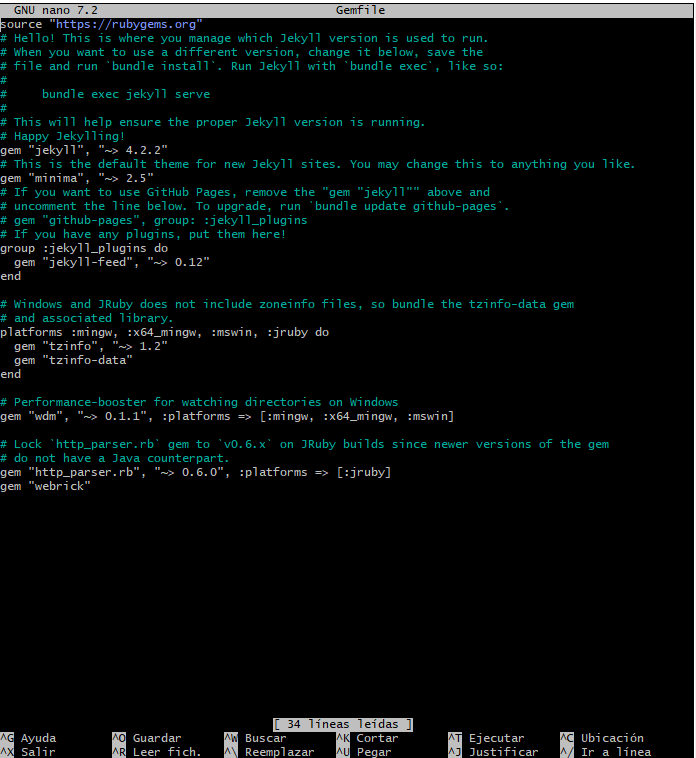
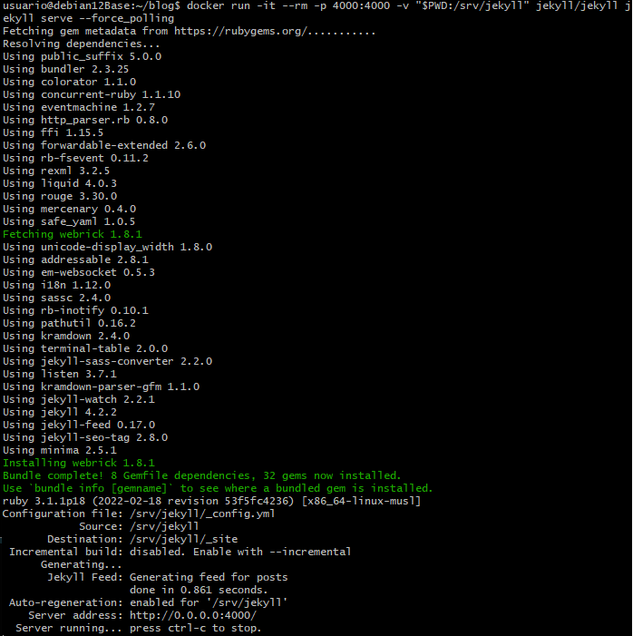
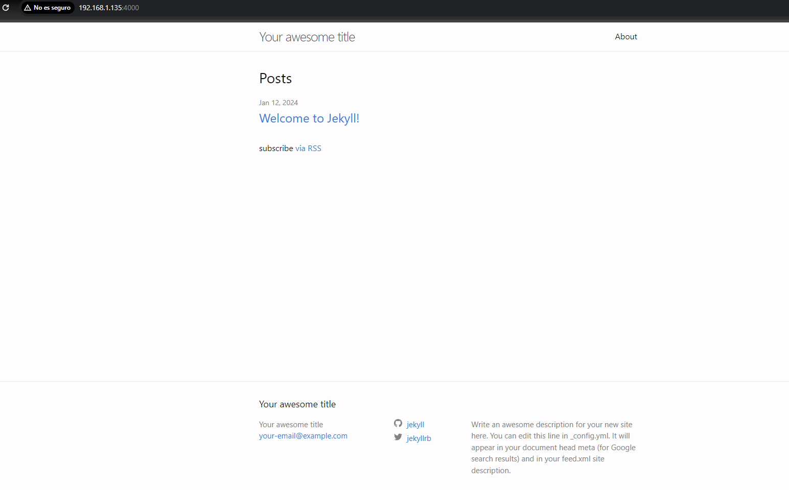

# Desplegando el tema de Jekyll "minima" utilizando dockers

## Indice:

[Paso 1](#paso-1)

[Paso 2](#paso-2)

[Paso 3](#paso-3)

[Paso 4](#paso-4)

[Paso 5](#paso-5)

## Paso 1:

  El primer paso es ***traer la imagen***, que usaremos para crear nuestro sitio en jekyll con el comando:
    
```
docker run -it --rm -v "$PWD:$HOME/repositorios/blog" jekyll/jekyll jekyll
```


## Paso 2:

  El siguinete paso sera ***montar el fichero donde estara nuestro blog*** con es siguiente comando:
  
```
docker run -it --rm -v "$PWD:$HOME/repositorios/blog" jekyll/jekyll jekyll new blog
```


## Paso 3:

  Despues entraremos en el ***Gemfile***:



## Paso 4:

***Arrancamos el sitio web apuntando al puerto 4000*** tanto con la maquina real como con el docker con el comando:

```
docker run -it --rm -p 4000:4000 -v "$PWD:$HOME/repositorios/blog" jekyll/jekyll jekyll serve --force_polling
```



## Paso 5:

  Voy a mi maquina real a poner la ***ip*** seguido del ***puerto*** para ver mi blog:



***La ip no es una 10.0.16.XX porque lo estoy haciendo desde mi ordenador en casa y tengo otra red.***
