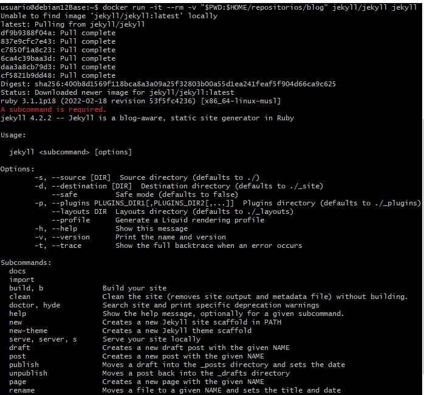
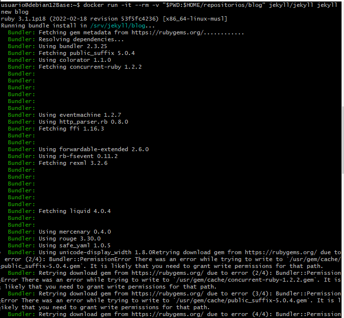
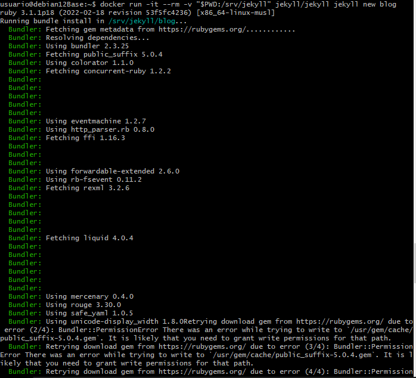

# Desplegando el tema de Jekyll "minima" utilizando dockers

## Indice:

[Paso 1](#paso-1)

[Paso 2](#paso-2)

[Paso 3](#paso-3)

[Paso 4](#paso-4)

[Paso 5](#paso-5)

## Paso 1:

  El primer paso es **traer la imagen**, que usaremos para crear nuestro sitio en jekyll con el comando:
    
```
docker run -it --rm -v "$PWD:$HOME/repositorios/blog" jekyll/jekyll jekyll
```



## Paso 2:

  El siguinete paso sera **montar el fichero donde estara nuestro blog** con es siguiente comando:
  
```
docker run -it --rm -v "$PWD:$HOME/repositorios/blog" jekyll/jekyll jekyll new blog
```



## Paso 3:

  Despues  



## Paso 4:

  Luego editaremos los ficheros:
+ **about.markdown**
+ **index.html**


## Paso 5:

  Despues crearemos una nueva '*page*' llamada **informacion** en forma de fichero markdown igual que el **about** y el **index**.


